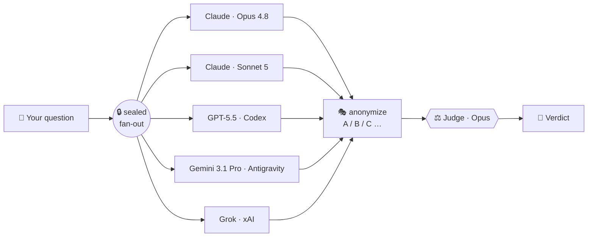

<div align="center">

# 🧬 LLM Fusion

### Many models in. One fused answer out.

**A sealed council of rival AI models — Claude, GPT, Gemini, and Grok — that argue your decision out behind a one-way mirror, then a judge hands you the verdict.**


</div>

---

Asking one model to double-check its own reasoning is grading your own homework. One model has one model's blind spots — and it will defend them confidently.

**LLM Fusion** convenes four *rival* vendors. They answer your question **independently and blind** — no model ever sees another's reply, and no past run leaks in. Their answers are stripped of identity and shuffled, then a judge weighs them on merit alone and fuses the best of all four into a single call. **The disagreement is the product.**

```
/fusion-council "Should I rewrite the billing service or wrap it?"
```
→ Opus, Sonnet 5, GPT‑5.5, Gemini 3.1 Pro, and Grok each answer behind the seal → anonymized A/B/C… → judged → **one decision memo, with the dissent shown.**

---

## ⚡ How it works



1. **Seal** — each model runs as its own isolated process. No cross-talk, no shared memory, no peeking. Anti-anchoring by construction.
2. **Anonymize** — answers are shuffled to letters and self-references scrubbed, so the judge can't favor a brand.
3. **Judge** — a judge (Opus, or *you*) reads only the anonymized answers and fuses them — agreements, the live disagreements, and a ruling.

---

## 🎬 See it actually run

Three real councils. Three people. Three decisions you'd genuinely want four sharp advisors for — not one confident chatbot. *(Verbatim stances from the sealed run; the verdict is the judge's synthesis.)*

### 💸 The founder — *"Raise now, or grind?"*

```
/fusion-council "4 months of runway, 40 paying users — raise a seed now or grind to profitability?"
```

**The room split:**
- 🟢 **Grind to strength** *(4 of 7)* — don't raise off a 4-month wall; cut burn, extend runway, and raise *from* strength, if at all.
- 🔴 **Timeboxed raise** *(2 of 7)* — run a strict ~45-day fundraising sprint with a hard circuit-breaker back to cost-cutting.

> ⚖️ **Verdict:** Cut burn *this week* to turn the death-clock into optionality — then, and only then, raise as a timeboxed sprint with a default-alive fallback.
>
> 💡 **The answer that reframed the question:** the *realist* refused to pick a side — *"40 users and 4 months aren't enough to choose; put your burn, MRR, margin and churn on the table first."* Sometimes the most valuable voice tells you you're not ready to ask yet.

### 🧭 The builder — *"Niche down, or stay broad?"*

```
/fusion-council "Narrow my product to one vertical, or stay horizontal to keep my options open?"
```

**The room agreed to narrow — then split on *what to narrow*:**
- 🟢 **Narrow the go-to-market** *(4 of 7)* — sell vertical (positioning, onboarding, ICP) but keep the engine horizontal in design.
- 🔵 **Narrow everything** *(2 of 7)* — full-commit to one vertical to kill the multi-cohort overhead.

> ⚖️ **Verdict:** Narrow your **message**, not your **codebase**. Pick one beachhead with *urgent budget*, sell it like you do nothing else — and keep the product horizontal underneath so you don't fork yourself into a corner.
>
> 💡 **The realist's check:** choose the vertical by which buyers have urgency and money *right now*, not by founder preference.

### 📈 The marketer — *"$5k of ad budget: all-in or split?"*

```
/fusion-council "My first \$5,000 of ad budget — all-in on one channel, or split across three?"
```

**The room split:**
- 🟢 **Concentrate** *(most of the room)* — an even 3-way split starves every channel's algorithm of data; you'll learn nothing.
- 🔴 **Scout, then concentrate** — a small ~15–20% test across 2–3 channels first, then pour the rest into the winner.

> ⚖️ **Verdict:** Don't spread $5k thin. Spend ~15–20% scouting 2–3 channels for real signal, then go all-in on the one that bites.
>
> 💡 **The skeptic's gut-punch:** *"Splitting $5k three ways starves the algorithms — guaranteeing a total loss of capital with zero actionable insight."* Meanwhile the realist went and pulled **live ad-market signals** to pick the scouting channels.

---

**One model hands you one of these answers, confidently.** A council hands you every camp, the dissent that reframes the question, *then* a ruling. That's the difference between a chatbot and a boardroom.

---

## 🚀 Quickstart

**Prerequisites** — LLM Fusion runs on your *own* authenticated CLIs, so there are **no API keys and no secrets on disk**. Install and log into the ones you want at the table (any 2+ vendors works; 4 is the full council):

| CLI | Vendor | Get it |
|---|---|---|
| `claude` | Anthropic | [Claude Code](https://docs.claude.com/en/docs/claude-code) |
| `codex` | OpenAI | ChatGPT/Codex subscription → `codex login` |
| `agy` | Google Antigravity | `curl -fsSL https://antigravity.google/cli/install.sh \| bash` |
| `grok` | xAI | `curl -fsSL https://x.ai/cli/install.sh \| bash` |

Then, in **Claude Code**:

```
/plugin marketplace add txelu21/llm-fusion
/plugin install llm-fusion@fusion
```

Check your seats are ready (Python 3.11+, zero runtime deps):

```bash
cd "$(ls -d ~/.claude/plugins/cache/*/llm-fusion/*/ | tail -1)"
python3 -m council_runner --doctor
```

That's it. `/fusion-council` and `/fusion-build` are live. Runs are written to `~/.llm-council/council-runs/` — never inside the plugin.

---

## 🪑 The council

Two commands, two kinds of diversity:

### 🧠 `/fusion-council` — decide
Seven expert **lenses** across five models pressure-test a decision. Each model wears a *different* hat:

| Lens | Model | What it hunts for |
|---|---|---|
| 🏛️ Architect | Claude Opus 4.8 | structure, interfaces, what's expensive to reverse |
| 🔬 First-principles | Claude Sonnet 5 | the premise everyone skipped |
| ⚙️ Pragmatist | GPT-5.5 (Codex) | the smallest thing that ships |
| 🥷 Skeptic | Gemini 3.1 Pro (Antigravity) | how it breaks in the real world |
| 🛠️ Operator | Gemini 3.1 Pro (Antigravity) | who runs this at 3am, and the cost |
| 🙋 User-advocate | GPT-5.5 (Codex) | the human at the other end |
| 🌍 Realist | Grok (xAI) | live market/world reality + timing |

### 🔨 `/fusion-build` — build
A **build-off**: every model plans the *same* task independently, the judge fuses the best plan into one spec, and a **single sandboxed agent builds it** — then a different model audits the result.

---

## 🔒 Why "sealed"? The whole point.

A council is only worth more than one model if the members can't herd. Every threat to that is defended:

| Threat | Defense |
|---|---|
| One model parrots another | Each round-1 agent is an isolated process in its own dir — it never sees a sibling's answer. |
| A prior run leaks forward | No session resume; the executor always runs memory-off. |
| The judge plays favorites | Answers shuffled to A/B/C; identity mapping kept out of the judge's view; self-references scrubbed. |
| A weak, lopsided council | Preflight requires ≥3 distinct models; a runtime warning fires if fewer survive. |
| A build agent wrecks real files | The build runs in a throwaway `git`-init'd sandbox — writable roots pinned, `/tmp` excluded, **network off**. Proven by `tests/test_sandbox_escape.py`. |

Codex is the **only** autonomous executor (the only CLI with a real OS-level seatbelt). Grok, Claude, and Antigravity advise and plan — they never touch your disk.

---

## 💸 Good to know

- **It spends four subscriptions per run** (one call per model, in parallel — Claude is hit twice, Opus + Sonnet 5). Reserve `/fusion-council` for genuine two-way-door decisions; it's a power tool, not a chatbot.
- **Graceful degradation** — if a CLI is logged out or rate-limited, the council proceeds on the survivors as long as quorum holds (≥2 answers from ≥2 vendors).
- **Fully editable roster** — adding a model is one line in `agents.yaml` + a role file. Swapping which model wears which lens is a one-line edit.

---

## 🙏 Credits

LLM Fusion was created by **[Gabriel Judah](https://github.com/gabrieljudah/llm-fusion)** — the sealed-council architecture, the codex sandbox, the judge backends, all his.

This is a **fork by [txelu21](https://github.com/txelu21/llm-fusion)** that adds:
- 🌍 **Grok (xAI)** as the 4th vendor — the *realist* lens (live web/market reality)
- 🛟 a **Gemini** fallback seat for the Google slot
- ⬆️ the Sonnet seat upgraded to **Sonnet 5**

> Updating the plugin? Always update the **`fusion` marketplace you added (`txelu21`)** — never re-add the upstream, or the Grok + Gemini additions get overwritten.

<div align="center">

**Many models in. One fused answer out.**

</div>
