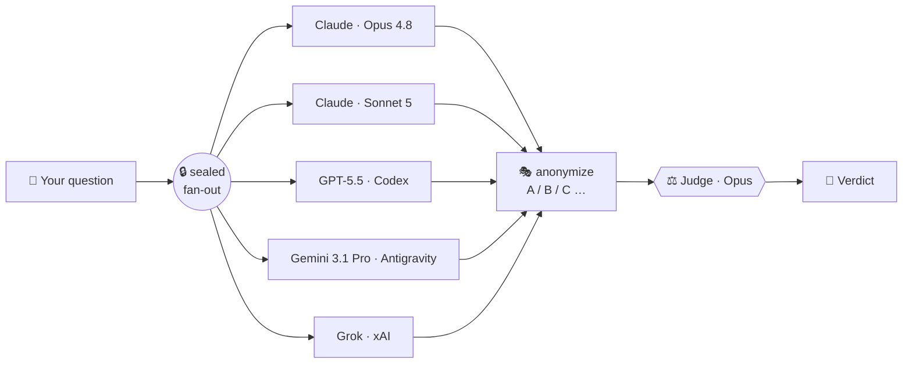

<div align="center">

# 🧬 LLM Fusion

### Many models in. One fused answer out.

**A sealed council of rival AI models — Claude, GPT, Gemini, and Grok — that argue your decision out behind a one-way mirror, then a judge hands you the verdict.**


</div>

---

Asking one model to double-check its own reasoning is grading your own homework. One model has one model's blind spots — and it will defend them confidently.

**LLM Fusion** convenes four *rival* vendors. They answer your question **independently and blind** — no model ever sees another's reply, and no past run leaks in. Their answers are stripped of identity and shuffled, then a judge weighs them on merit alone and fuses the best of all four into a single call. **The disagreement is the product.**

```
/fusion-council "Should I rewrite the billing service or wrap it?"
```
→ Opus, Sonnet 5, GPT‑5.5, Gemini 3.1 Pro, and Grok each answer behind the seal → anonymized A/B/C… → judged → **one decision memo, with the dissent shown.**

---

## ⚡ How it works



1. **Seal** — each model runs as its own isolated process. No cross-talk, no shared memory, no peeking. Anti-anchoring by construction.
2. **Anonymize** — answers are shuffled to letters and self-references scrubbed, so the judge can't favor a brand.
3. **Judge** — a judge (Opus, or *you*) reads only the anonymized answers and fuses them — agreements, the live disagreements, and a ruling.

---

## 🎬 See it actually run

A real `/fusion-council` run (verbatim) — a deliberately low-stakes test decision, *"is a 50-line one-off CSV→JSON script worth unit tests + argparse?"* — fanned out to **7 lenses across 5 models**:

| Sealed answer | Recommendation | Confidence |
|:---:|---|:---:|
| A | Lightweight CLI paths; tests only if the transform is non-trivial | med |
| B | Stay minimal + hardcoded, fail-fast validation | high |
| C | Skip tests; **strict runtime schema assertions, fail loud** | high |
| D | One pure transform function + one test on it; named constants > argparse | high |
| E | argparse + schema assertions + atomic writes | high |
| F | Lightweight argparse + validation + one smoke test | high |
| G | Maybe **no Python at all** — `csvjson`/`jq` one-liner | high |

> **⚖️ Judge's verdict:** *Skip the formal test suite. Spend the effort on the two things the council near-unanimously flagged as the real risk — loud input validation and parameterized I/O — and factor the transform into one pure function (the only choice that's expensive to reverse). High confidence: 6 of 7 converged; the dissent (G) usefully questioned whether the script should exist at all.*

Five rival models, one fused answer — and a dissent you'd never have heard from a single model.

---

## 🚀 Quickstart

**Prerequisites** — LLM Fusion runs on your *own* authenticated CLIs, so there are **no API keys and no secrets on disk**. Install and log into the ones you want at the table (any 2+ vendors works; 4 is the full council):

| CLI | Vendor | Get it |
|---|---|---|
| `claude` | Anthropic | [Claude Code](https://docs.claude.com/en/docs/claude-code) |
| `codex` | OpenAI | ChatGPT/Codex subscription → `codex login` |
| `agy` | Google Antigravity | `curl -fsSL https://antigravity.google/cli/install.sh \| bash` |
| `grok` | xAI | `curl -fsSL https://x.ai/cli/install.sh \| bash` |

Then, in **Claude Code**:

```
/plugin marketplace add txelu21/llm-fusion
/plugin install llm-fusion@fusion
```

Check your seats are ready (Python 3.11+, zero runtime deps):

```bash
cd "$(ls -d ~/.claude/plugins/cache/*/llm-fusion/*/ | tail -1)"
python3 -m council_runner --doctor
```

That's it. `/fusion-council` and `/fusion-build` are live. Runs are written to `~/.llm-council/council-runs/` — never inside the plugin.

---

## 🪑 The council

Two commands, two kinds of diversity:

### 🧠 `/fusion-council` — decide
Seven expert **lenses** across five models pressure-test a decision. Each model wears a *different* hat:

| Lens | Model | What it hunts for |
|---|---|---|
| 🏛️ Architect | Claude Opus 4.8 | structure, interfaces, what's expensive to reverse |
| 🔬 First-principles | Claude Sonnet 5 | the premise everyone skipped |
| ⚙️ Pragmatist | GPT-5.5 (Codex) | the smallest thing that ships |
| 🥷 Skeptic | Gemini 3.1 Pro (Antigravity) | how it breaks in the real world |
| 🛠️ Operator | Gemini 3.1 Pro (Antigravity) | who runs this at 3am, and the cost |
| 🙋 User-advocate | GPT-5.5 (Codex) | the human at the other end |
| 🌍 Realist | Grok (xAI) | live market/world reality + timing |

### 🔨 `/fusion-build` — build
A **build-off**: every model plans the *same* task independently, the judge fuses the best plan into one spec, and a **single sandboxed agent builds it** — then a different model audits the result.

---

## 🔒 Why "sealed"? The whole point.

A council is only worth more than one model if the members can't herd. Every threat to that is defended:

| Threat | Defense |
|---|---|
| One model parrots another | Each round-1 agent is an isolated process in its own dir — it never sees a sibling's answer. |
| A prior run leaks forward | No session resume; the executor always runs memory-off. |
| The judge plays favorites | Answers shuffled to A/B/C; identity mapping kept out of the judge's view; self-references scrubbed. |
| A weak, lopsided council | Preflight requires ≥3 distinct models; a runtime warning fires if fewer survive. |
| A build agent wrecks real files | The build runs in a throwaway `git`-init'd sandbox — writable roots pinned, `/tmp` excluded, **network off**. Proven by `tests/test_sandbox_escape.py`. |

Codex is the **only** autonomous executor (the only CLI with a real OS-level seatbelt). Grok, Claude, and Antigravity advise and plan — they never touch your disk.

---

## 💸 Good to know

- **It spends four subscriptions per run** (one call per model, in parallel — Claude is hit twice, Opus + Sonnet 5). Reserve `/fusion-council` for genuine two-way-door decisions; it's a power tool, not a chatbot.
- **Graceful degradation** — if a CLI is logged out or rate-limited, the council proceeds on the survivors as long as quorum holds (≥2 answers from ≥2 vendors).
- **Fully editable roster** — adding a model is one line in `agents.yaml` + a role file. Swapping which model wears which lens is a one-line edit.

---

## 🙏 Credits

LLM Fusion was created by **[Gabriel Judah](https://github.com/gabrieljudah/llm-fusion)** — the sealed-council architecture, the codex sandbox, the judge backends, all his.

This is a **fork by [txelu21](https://github.com/txelu21/llm-fusion)** that adds:
- 🌍 **Grok (xAI)** as the 4th vendor — the *realist* lens (live web/market reality)
- 🛟 a **Gemini** fallback seat for the Google slot
- ⬆️ the Sonnet seat upgraded to **Sonnet 5**

> Updating the plugin? Always update the **`fusion` marketplace you added (`txelu21`)** — never re-add the upstream, or the Grok + Gemini additions get overwritten.

<div align="center">

**Many models in. One fused answer out.**

</div>
